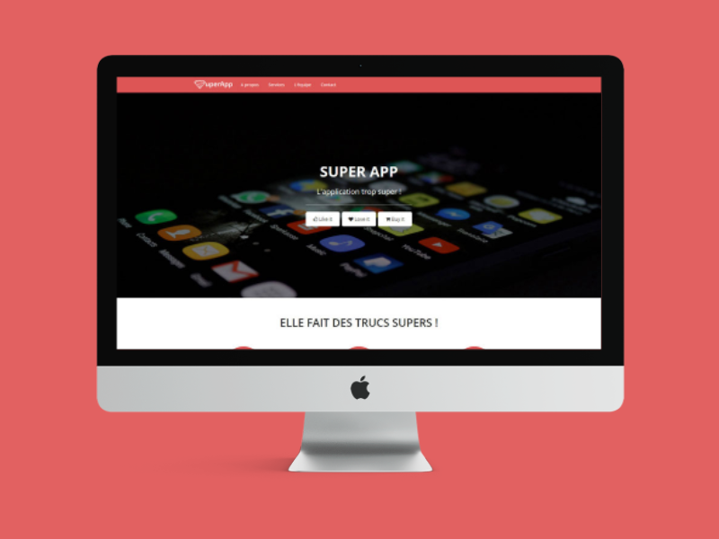

# Home page HTML integration for Super App

  

## Process

### Analyse
- Analyse the wireframe : cut out the model desktop and mobile (body, margins, elements, content...)
- Retrieve the content : graphic identity (colors, fonts, icons), download medias
- Analyse elements in detail : analyse differences between mobile and desktop wireframe

