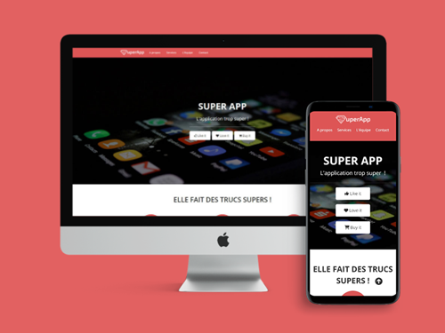

# Home page HTML integration for Super App

  

## Process

### Analyse
- Analyse the wireframe : cut out the model desktop and mobile (body, margins, elements, content...) with Adobe Xd
- Retrieve the content : graphic identity (colors, fonts, icons), download medias
- Analyse elements in detail : analyse differences between mobile and desktop wireframe

### Tools choices
- Client does'nt need to administrate the website : don't need CMS
- The client only wants a simple showcase site
- I choose to code with simple HTML / CSS using the text editor Visual Studio Code and Prepros as a local server.

> Later i'll install PostCSS to use plugins and automatize my tasks : 
> minimize css code, prettify html, check the accessibility, optimize medias...

